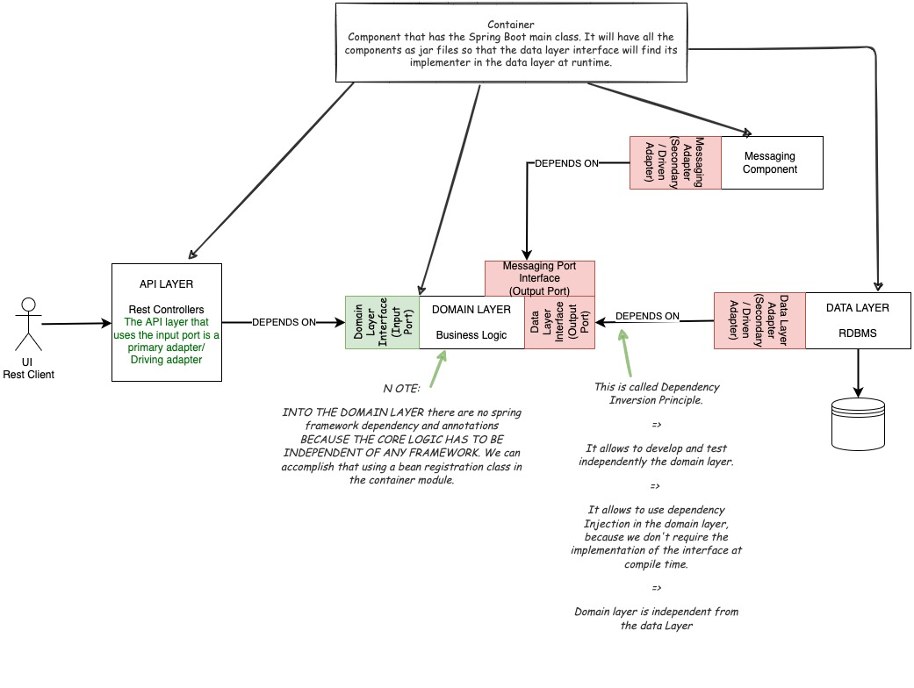
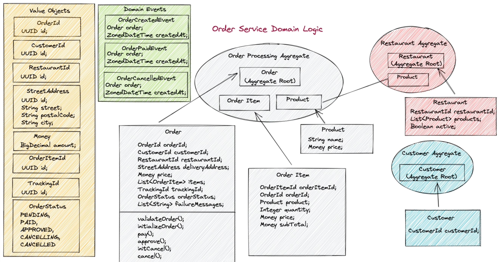
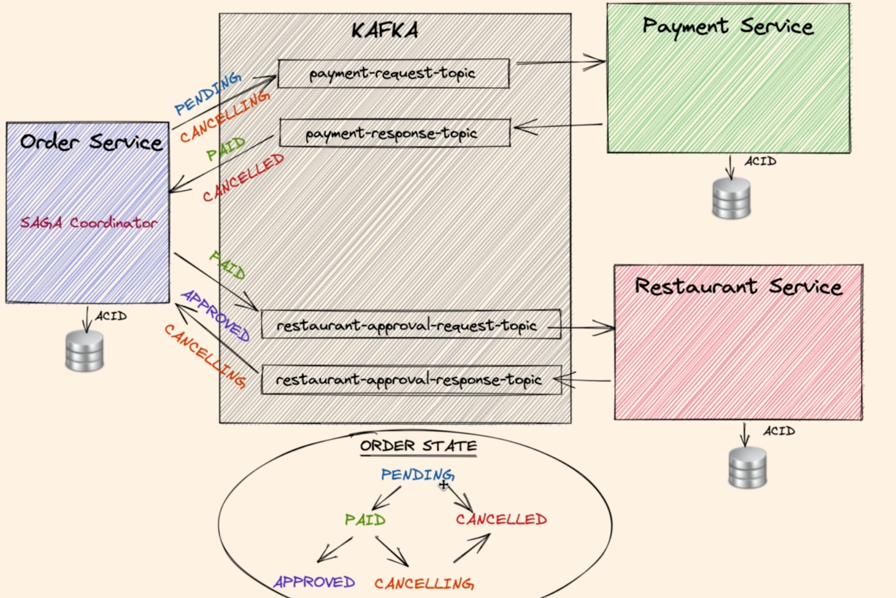
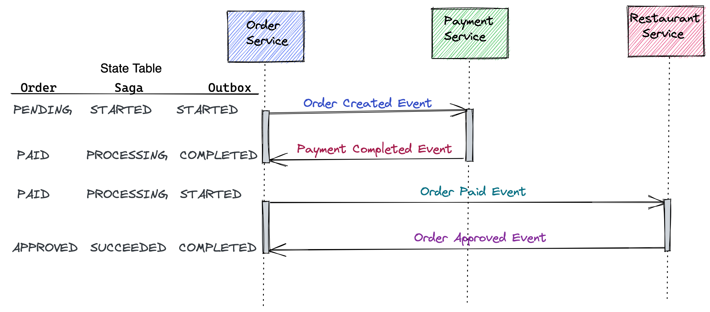
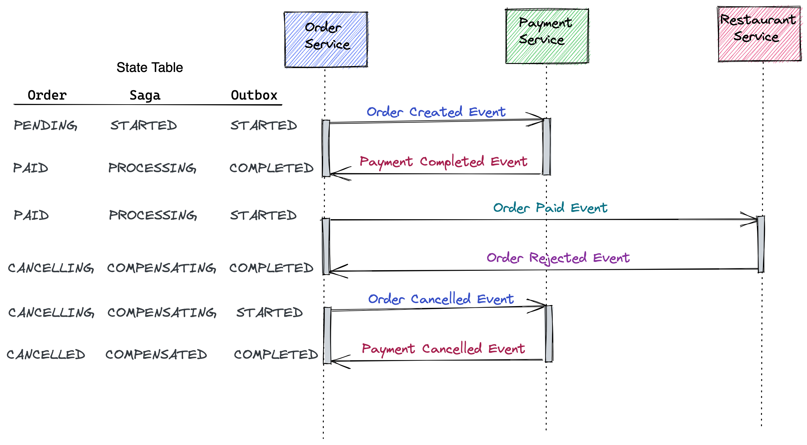
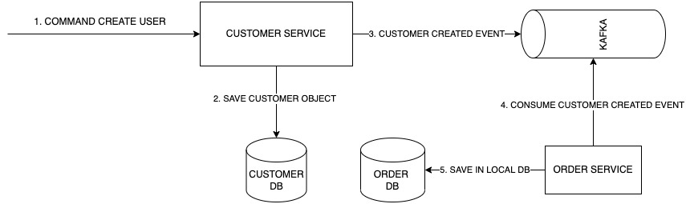
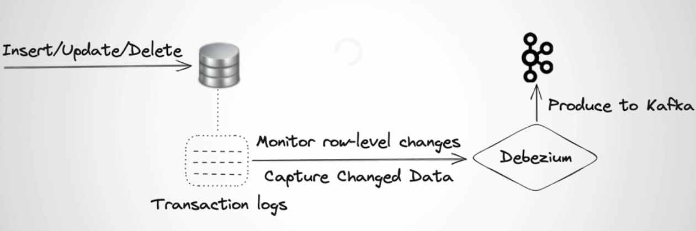
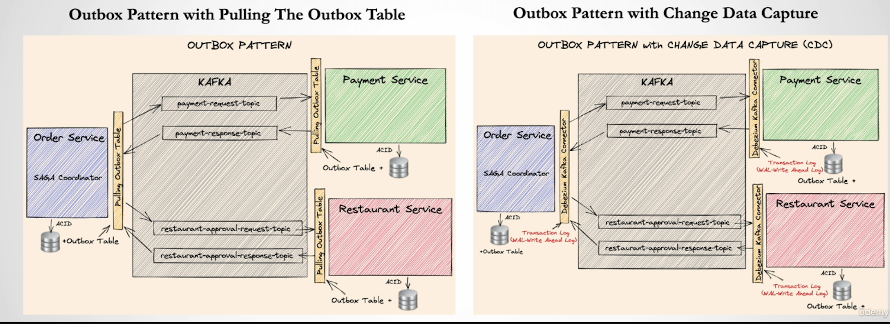

# Event-Driven Microservices — Advanced

A production-grade food ordering system built with four Spring Boot microservices communicating asynchronously via Apache Kafka. Implements hexagonal architecture, DDD, Saga, Outbox, CQRS, and CDC patterns. Deployed on GKE using Terraform, ArgoCD, and GitHub Actions.

---

## Architecture

### Clean Architecture (Order Service)



### Domain-Driven Design (Order Service)



---

## Saga Pattern — Order State Transitions



The order-service orchestrates a distributed transaction across payment-service and restaurant-service using compensating transactions:

```
POST /orders → order-service
  → payment-request              → payment-service
  → payment-response             → order-service         (PAID)
  → restaurant-approval-request  → restaurant-service
  → restaurant-approval-response → order-service         (APPROVED)
```

Payment failure rolls back to `CANCELLED`. Restaurant rejection after payment triggers a refund event and rolls back to `CANCELLED`.

---

## Outbox Pattern


Solves the dual-write problem: domain events are written to a local `*_outbox` table **in the same DB transaction** as the business write, guaranteeing at-least-once delivery to Kafka without a distributed transaction.

### Happy flow


### Payment failure


### Restaurant rejection


---

## CQRS



The order-service maintains separate read and write models. The customer-service CQRS projection does not use the outbox pattern — eventual consistency there is not guaranteed under failure.

---

## Change Data Capture (CDC)



Debezium reads PostgreSQL's WAL (Write-Ahead Log) and streams outbox rows directly to Kafka, replacing the polling scheduler.



---

## Tech Stack

| Layer | Technology |
|-------|-----------|
| Services | Spring Boot 2.7, Java 17 |
| Messaging | Apache Kafka (Strimzi on GKE), Avro, Confluent Schema Registry |
| Database | Cloud SQL PostgreSQL 15 (private IP, Cloud SQL Auth Proxy sidecar) |
| Infrastructure | Terraform, GKE Standard, Google Artifact Registry |
| GitOps | ArgoCD + Helm |
| CI/CD | GitHub Actions + Workload Identity Federation (no stored credentials) |
| Secrets | GCP Secret Manager + External Secrets Operator |
| IaC security | tfsec |

---

## Deployment

The full step-by-step guide is in **[GCP-IMPLEMENTATION.md](./GCP-IMPLEMENTATION.md)**.

### CI/CD Overview

```
push to infra/terraform/**
  └── terraform.yml
        ├── tfsec security scan        (blocks on HIGH/CRITICAL findings)
        ├── terraform plan             (uploads plan artifact)
        └── terraform apply  ◄──────── requires human approval (GitHub Environment)

push to app code
  └── build.yml
        ├── mvn clean package -DskipTests
        └── push 4 images to Artifact Registry (tagged with git SHA + latest)
              └── deploy.yml  (triggered automatically after build succeeds)
                    ├── update infra/helm/food-ordering/values-prod.yaml
                    ├── commit + push  ◄── ArgoCD detects the change
                    └── poll ArgoCD until Healthy + Synced
```

Run **bootstrap.yml** once after cluster creation to install operators (ArgoCD, Strimzi, ESO) and apply Kafka infrastructure.

---

## API

After deployment, get the external IP:

```bash
kubectl get ingress food-ordering-ingress -n app
```

**Create a customer** (required before placing orders):
```bash
curl -X POST http://EXTERNAL_IP/customers \
  -H "Content-Type: application/json" \
  -d '{
    "customerId": "d215b5f8-0249-4dc5-89a3-51fd148cfb41",
    "username": "user_1",
    "firstName": "Armando",
    "lastName": "Maradona"
  }'
```

**Place an order:**
```bash
curl -X POST http://EXTERNAL_IP/orders \
  -H "Content-Type: application/json" \
  -d '{
    "customerId": "d215b5f8-0249-4dc5-89a3-51fd148cfb41",
    "restaurantId": "d215b5f8-0249-4dc5-89a3-51fd148cfb45",
    "address": { "street": "street_1", "postalCode": "1000AB", "city": "Amsterdam" },
    "price": 200.00,
    "items": [
      { "productId": "d215b5f8-0249-4dc5-89a3-51fd148cfb48", "quantity": 1, "price": 50.00, "subTotal": 50.00 },
      { "productId": "d215b5f8-0249-4dc5-89a3-51fd148cfb48", "quantity": 3, "price": 50.00, "subTotal": 150.00 }
    ]
  }'
```

**Track order status** (use `trackingId` from the order response):
```bash
curl http://EXTERNAL_IP/orders/{orderTrackingId}
# PENDING → PAID (within seconds) → APPROVED (within ~10s outbox cycle)
```

Repeating the same order POST will fail due to insufficient funds — this exercises the payment failure rollback path.
